# Zima OS / Casa OS / Homeio - Third Party Community App Store

A Community app store for [ZimaOS](https://www.zimaspace.com/ZimaOS), [CasaOS](https://casaos.io/) and [Homeio](https://homeio.app/), maintained by [HSinghHira](https://github.com/HSinghHira).

---

## 🟢 ZimaOS

ZimaOS reads app stores from a `store.json` manifest.

1.  Open the **ZimaOS** dashboard.

2.  Go to **App Store** → click the **⚙️ Community store**.

3.  Click ➕ **Icon**.

4.  Paste below URL:

        https://ZimaOS.HSinghHira.me/store.json

5.  **Add**, then refresh the App Store page.

> 💡 If the store doesn’t show up right away, try refreshing or restarting the App Store service — ZimaOS occasionally caches store sources.

---

## 🟠 CasaOS

CasaOS doesn’t read `store.json` — instead, it can install a full custom app store from a **zip archive**.

1.  Open the **CasaOS** dashboard.

2.  Go to **App Store**.

3.  Click on **+ Add Source**.

4.  Paste in the store archive URL:

        https://ZimaOS.HSinghHira.me/latest.zip

5.  Confirm **Add**.

> 💡 `latest.zip` always points to the most recent build — no need to update the link when new apps are added.

---

## 🟣 Homeio

1.  Open the **Homeio** dashboard.

2.  Click on **App Store**.

3.  Click **+ Install** button.

4.  Go to **Manage Sources**.

5.  Paste in below Store URL:

        https://ZimaOS.HSinghHira.me/latest.zip

6.  Enter desired name like “Hira’s App Store”.

7.  Click **Add Source** button.

> 💡 `latest.zip` always points to the most recent build — no need to update the link when new apps are added.

---

## 📦 Apps

| App | Thumbnail |
| :--- | :--- |
| <h2> AFFiNE</h2>      AFFiNE is an open-source, all-in-one workspace that combines rich-text documents, an infinite-canvas whiteboard, and structured databases into a single integrated editor — think Notion and Miro combined. | 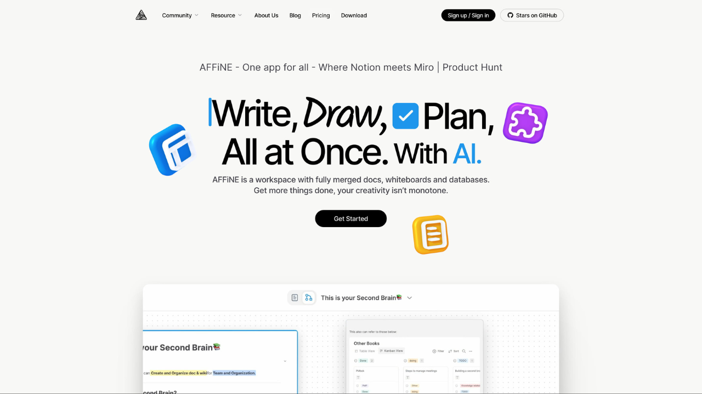 |
| <h2> BookOrbit</h2>      BookOrbit is a self-hosted digital library and reading platform for EPUB, MOBI, AZW3, PDF, CBZ/CBR comics, and M4B/MP3 audiobooks, with sync to Kobo and KOReader devices, rich metadata lookup, and OPDS support. | 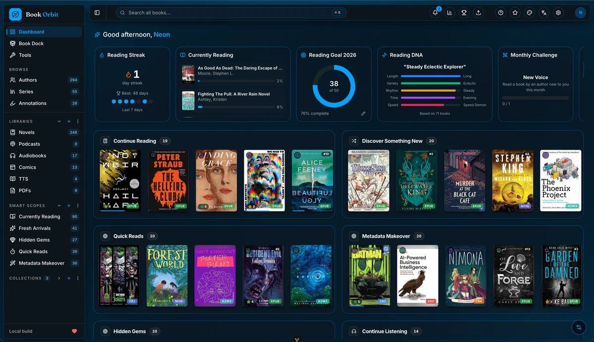 |
| <h2> Claude Code</h2>      Run Claude Code — Anthropic’s AI coding CLI — in a persistent, browser-based terminal. | 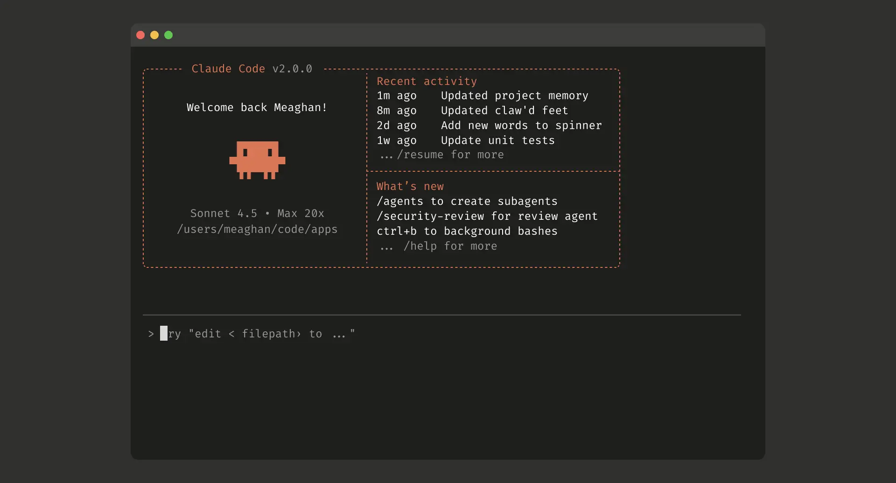 |
| <h2> Cloudreve</h2>     _(tcp+udp)_   Cloudreve is a self-hosted cloud drive that lets you manage files across multiple storage backends (local disk, S3, OneDrive, and more) through a single polished web interface, with sharing, permissions, and offline downloads built in. | 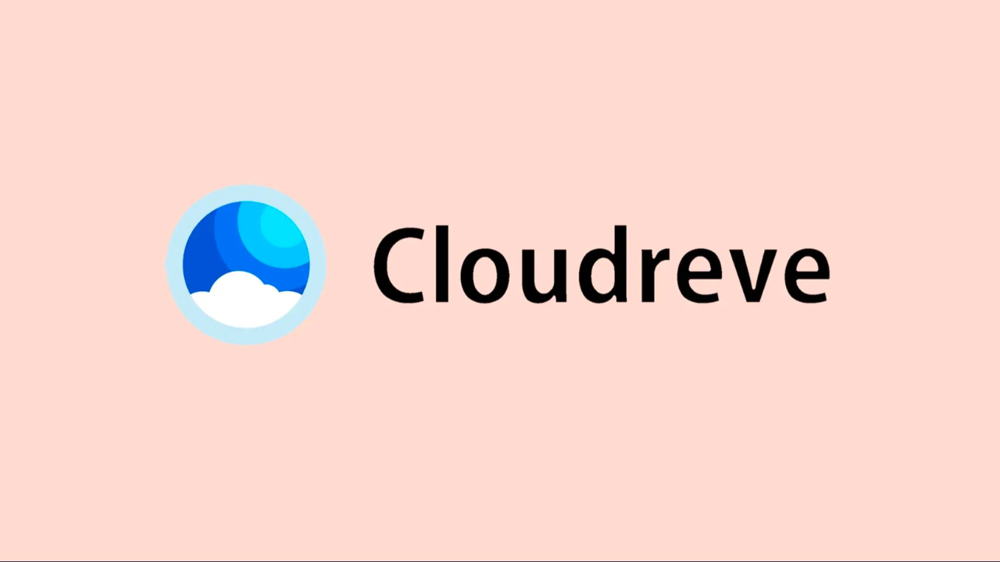 |
| <h2> Cobalt</h2>       Cobalt is a self-hosted media downloader that saves videos, audio, and images from popular platforms without ads, trackers, or watermarks, giving you a clean, private front end for grabbing content you want to keep. | 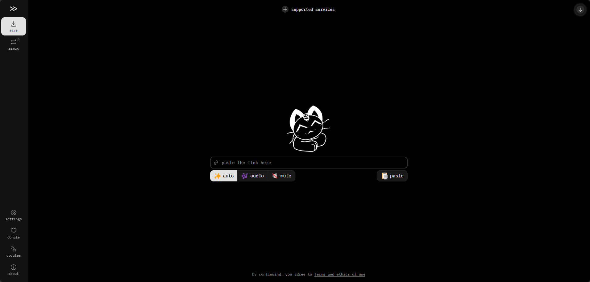 |
| <h2> Coder</h2>      Self-hosted, browser-based remote development environments — think a self-hosted GitHub Codespaces. | 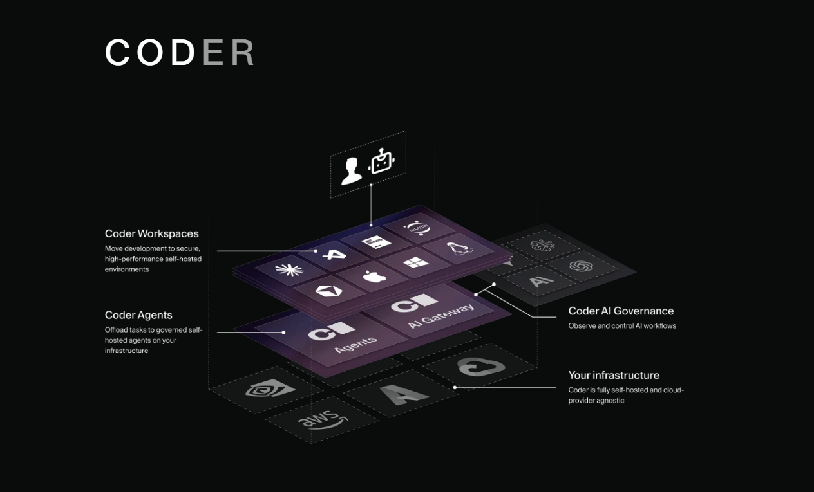 |
| <h2> Continuwuity</h2>      Continuwuity is a community-maintained fork of Conduwuit, a lightweight Matrix homeserver written in Rust, letting you self-host your own federated chat server without the overhead of the reference Synapse implementation. | 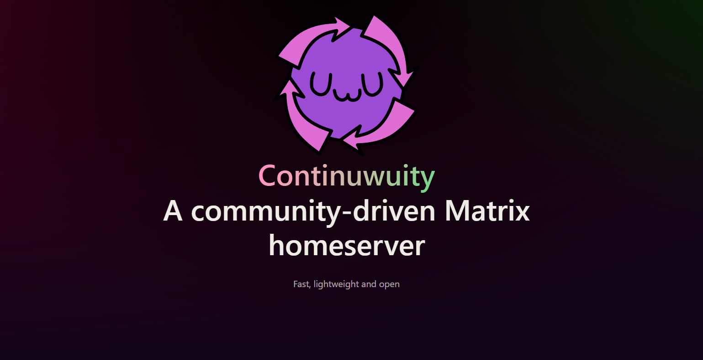 |
| <h2> deGoog</h2>      deGoog is a self-hosted search engine aggregator that queries multiple providers at once and merges the results into one clean, tracker-free interface, with a plugin system for custom engines, bang commands, and themes. |  |
| <h2> Dispatcharr</h2>      Dispatcharr is a self-hosted IPTV and M3U management tool that lets you organize channels, build custom playlists, and manage EPG data through a web dashboard, acting as a hub between your streaming sources and the players that consume them. | 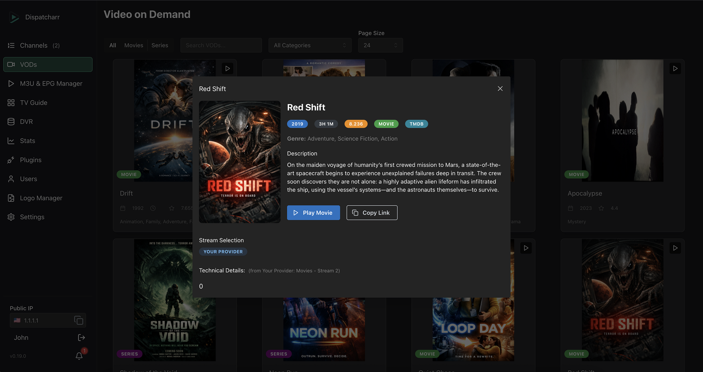 |
| <h2> Docmost</h2>      Docmost is a modern, open-source, end-to-end encrypted wiki & knowledge base built with Laravel, Vue, and Qdrant — it lets you capture, organize, and privately share your knowledge with real-time collaboration, semantic search, and Git-style version history. | 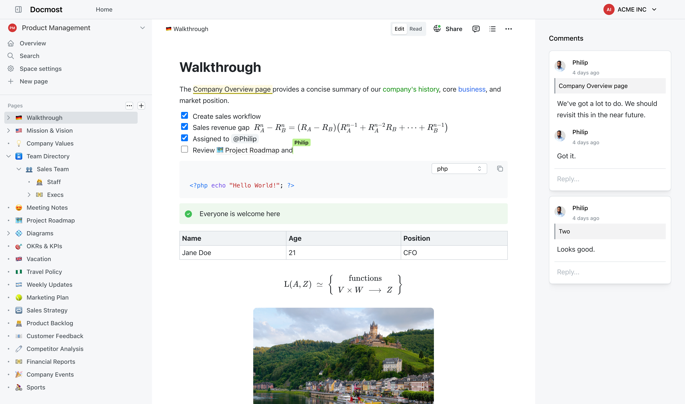 |
| <h2> DocuSeal</h2>      DocuSeal is an open-source platform for filling and signing digital documents. Build a fillable PDF form once, then send it out for one or more people to sign. | 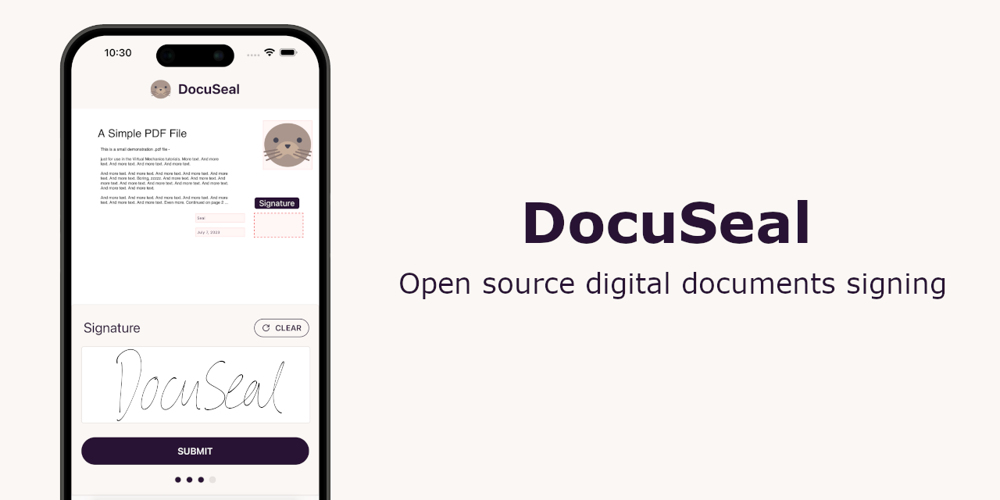 |
| <h2> Documenso</h2>      Documenso is an open source document-signing platform — think DocuSign, but self-hosted and fully auditable. |  |
| <h2> Ente</h2>          Ente is an end-to-end encrypted photo and video storage platform that you can self-host, offering automatic backup, cross-device sync, and private sharing without handing your memories over to a third party. | 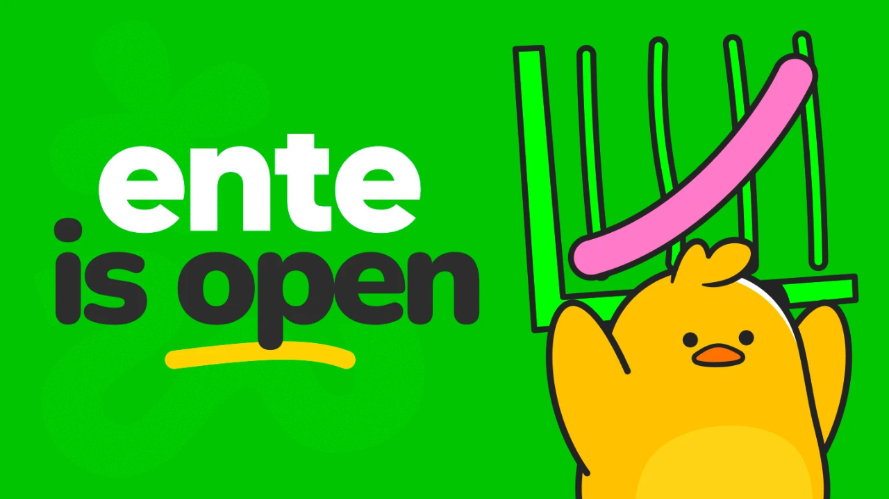 |
| <h2> GameVault</h2>      GameVault is a self-hosted gaming platform that lets you and your friends enjoy DRM-free games stored on your own file server in an organized, Steam-like library. | 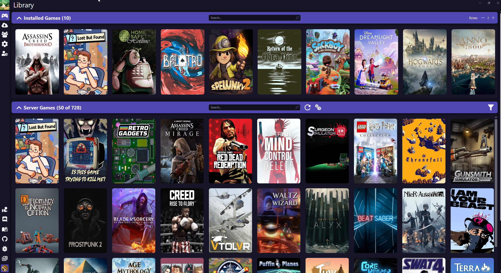 |
| <h2> Helix</h2>      Self-hosted Pandora/Spotify built on your own Subsonic-compatible music library — generated stations, shared listening lobbies, and optional fulfillment/import. | 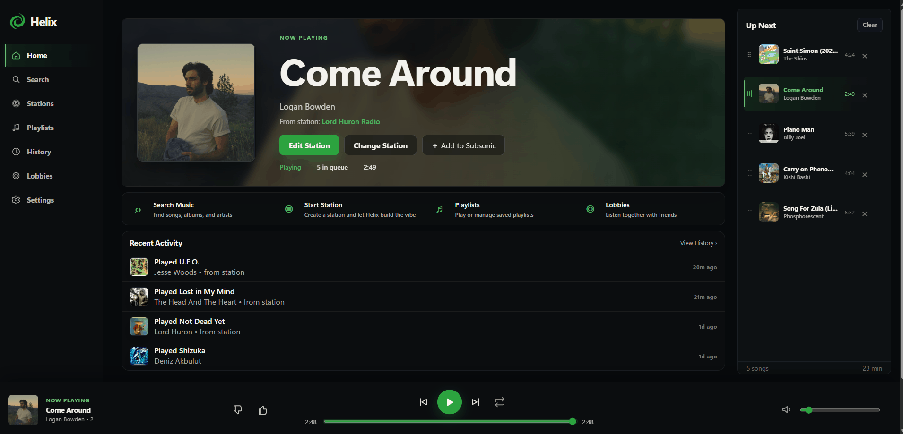 |
| <h2> Homelable</h2>      Homelable is a self-hosted infrastructure visualizer — scan your network, drop discovered devices onto a canvas, and watch live health-checks light up as your homelab goes on- and offline. | 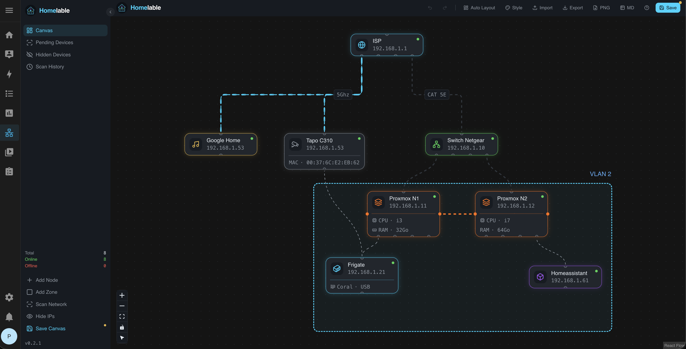 |
| <h2> Indelible</h2>      Self-hosted, open-source knowledge library and read-it-later archiver — think a private Pocket or Readwise that stores everything you save, permanently. |  |
| <h2> Mailpit</h2>       Mailpit is a self-hosted email testing tool that catches all outgoing SMTP mail from your apps in one inbox-style web UI, making it easy to inspect, debug, and preview emails during development without ever sending real messages. |  |
| <h2> NodeCast TV</h2>      NodeCast TV is a self-hosted, browser-based IPTV player for Live TV, Movies, and Series from Xtream Codes or M3U sources, with an interactive EPG guide, favorites, and optional hardware-accelerated transcoding for large channel libraries. |  |
| <h2> OmniCloud</h2>      OmniCloud brings Google Drive, OneDrive, Dropbox, Yandex Disk, MEGA, pCloud, and S3-compatible storage into a single, consistent file workspace, so you can browse, upload, and manage everything from one place instead of switching between apps. | 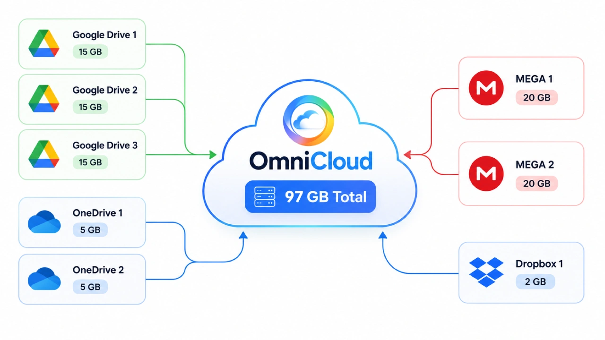 |
| <h2> OmniRoute</h2>      OmniRoute is a self-hosted AI gateway that puts one OpenAI-compatible endpoint in front of hundreds of LLM providers and models, with smart routing, automatic fallback, rate limiting, and a dashboard for cost and usage observability. | 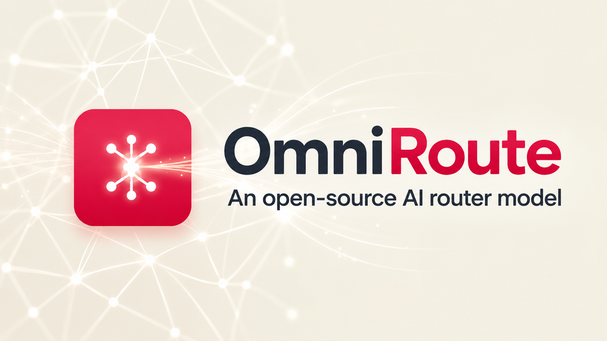 |
| <h2> openGym</h2>      openGym is a self-hosted gym and body-weight tracker: plan routines, log workouts (supersets and cardio included), and track your weight and progress over time, all stored on your own server. | 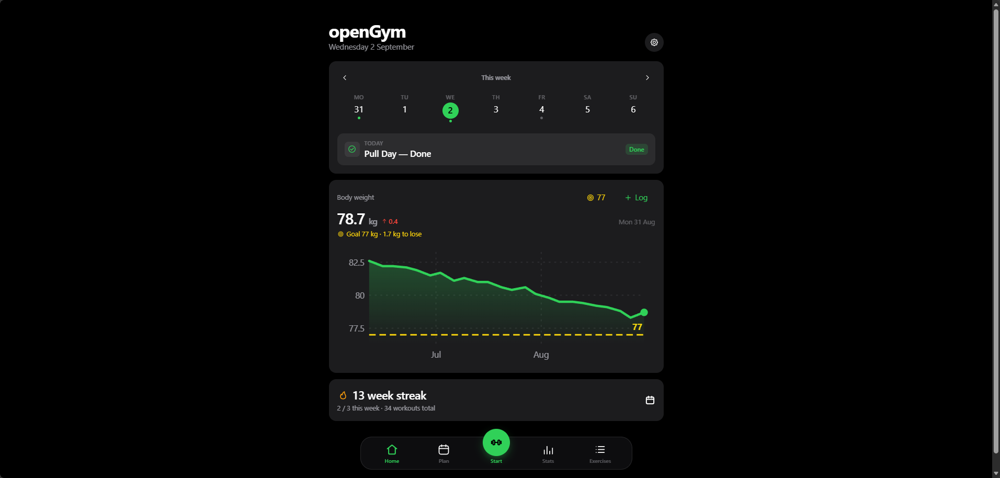 |
| <h2> Outline</h2>      Outline is a fast, beautifully designed self-hosted wiki and knowledge base for teams, with real-time collaborative editing, nested collections, powerful search, Markdown support, and integrations through its API. It supports OIDC authentication and uses PostgreSQL, Redis, and persistent file storage for a complete self-hosted knowledge management platform. | 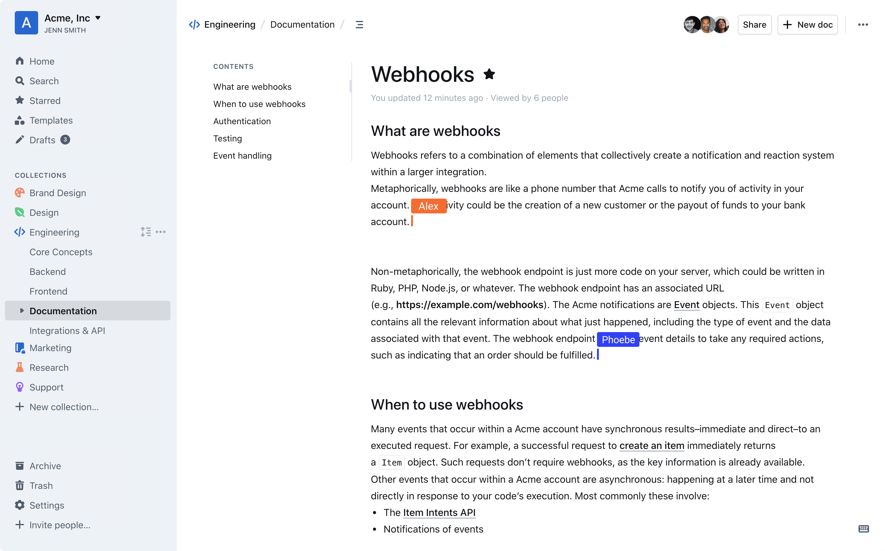 |
| <h2> Pocket ID</h2>      Pocket ID is a simple, self-hosted OpenID Connect identity provider that provides secure single sign-on (SSO) for your self-hosted applications. It supports passkeys, user management, groups, and OIDC authentication, making it easy to use one secure identity across multiple services. |  |
| <h2> SearXNG</h2>      SearXNG is a free, privacy-respecting metasearch engine that aggregates results from dozens of search services without tracking or profiling you, and is fully self-hostable and highly customizable through its extensive settings and engine list. |  |
| <h2> SkySend</h2>      SkySend is a minimalist, end-to-end encrypted file and note sharing service. Files and notes are encrypted entirely in your browser before upload, so the server only ever stores encrypted blobs and never sees the decryption key. | 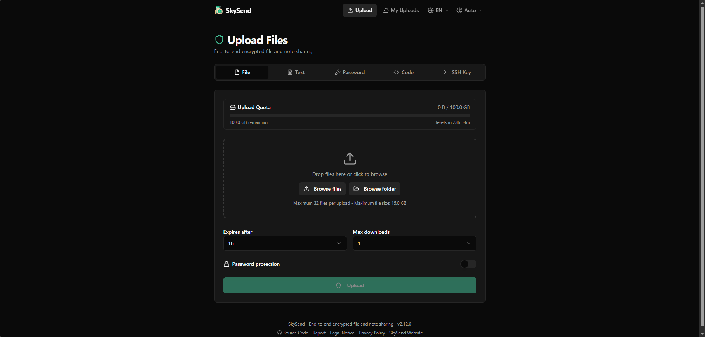 |
| <h2> SpiderFoot</h2>      SpiderFoot automates OSINT reconnaissance, querying 200+ data sources to map out everything public about a domain, IP, or identity. | 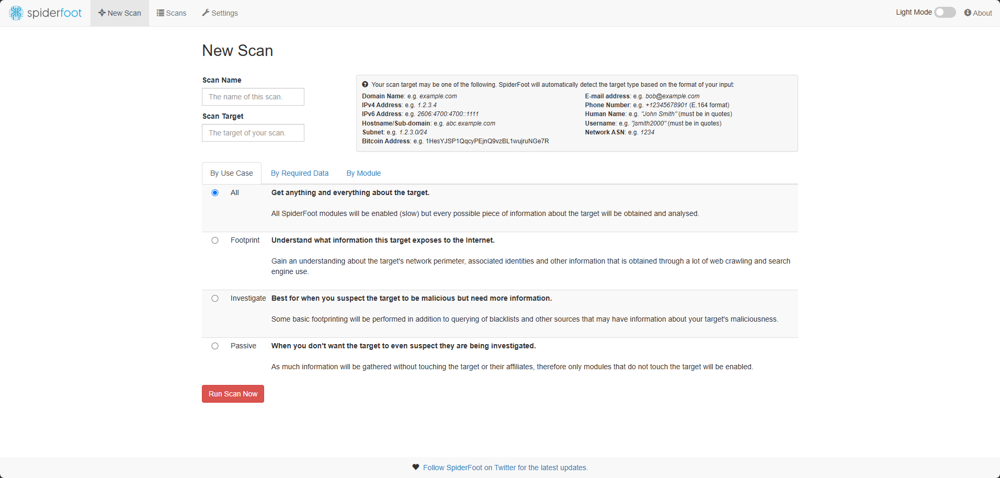 |
| <h2> Stoat Chat</h2>        Stoat (formerly Revolt) is an open-source, self-hosted chat platform that looks and feels like Discord — servers, channels, roles, custom emoji, and file sharing — without handing your community’s data to a third party. | 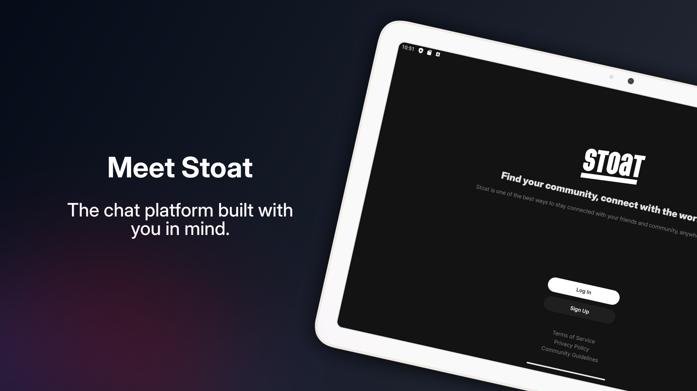 |
| <h2> Tianji</h2>      Tianji is an all-in-one insight hub — think Google Analytics, Uptime Kuma, and a server status page combined into a single lightweight self-hosted app. | 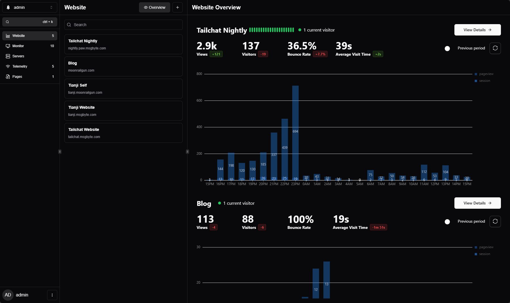 |
| <h2> VERT</h2>      VERT is an open-source, next-generation file converter that runs conversions directly on your device using WebAssembly instead of uploading files to a cloud service, a private, self-hosted alternative to online conversion sites. | 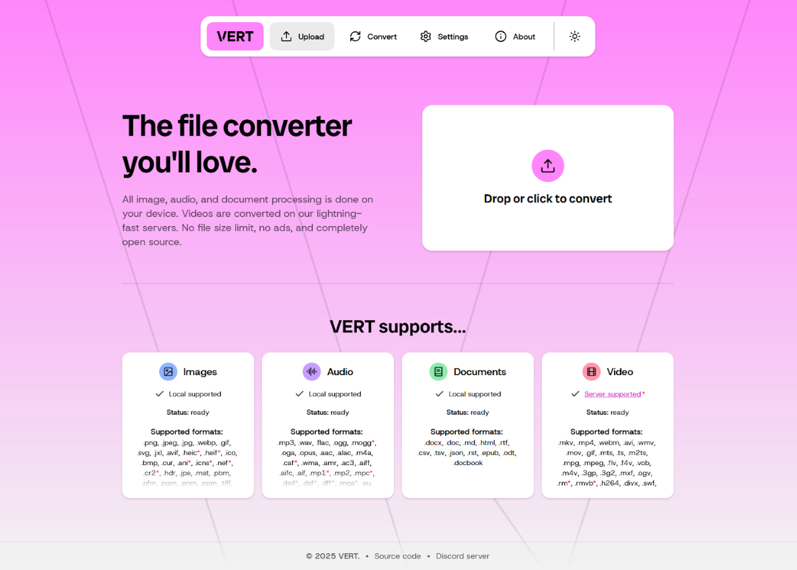 |
| <h2> Web-Check</h2>      Web-Check is a self-hosted OSINT tool that runs dozens of checks against any domain — DNS, SSL, headers, hosting, tech stack, and more — and lays it all out in one clean report. | 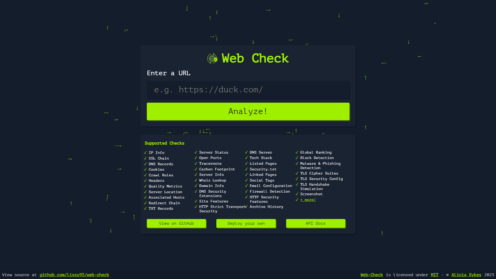 |
| <h2> Yuvomi</h2>      Yuvomi is a self-hosted family planner that replaces a dozen separate subscription apps — tasks, calendar, budget, shopping, meals and more — with one private place that runs on your own server. | 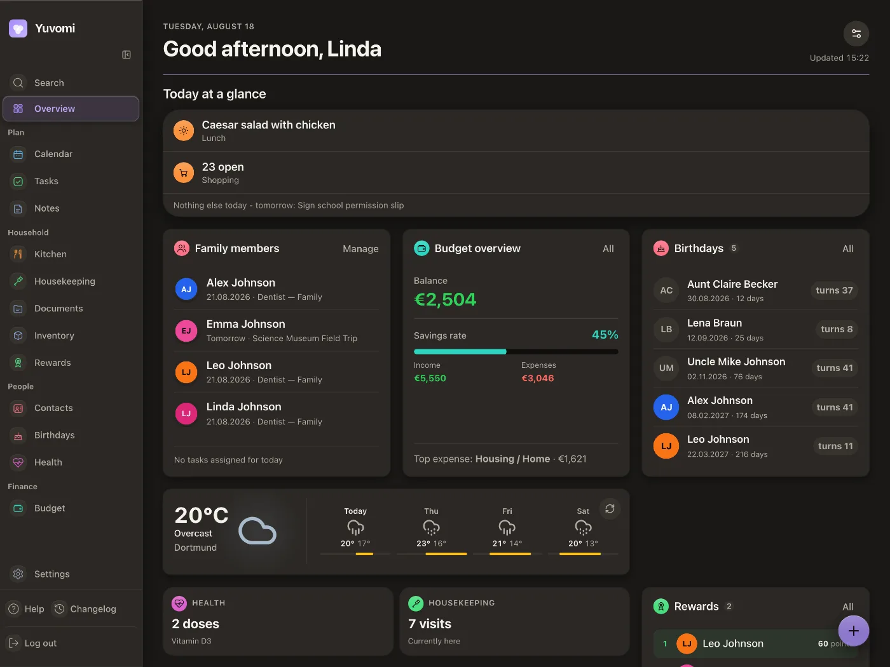 |
| <h2> ZimaBrain CE</h2>      ZimaBrain CE is a local diagnostic assistant that reads real evidence from your ZimaOS box — disks, containers, mounts, and network state — before it ever tells you what’s wrong or what to run next. | 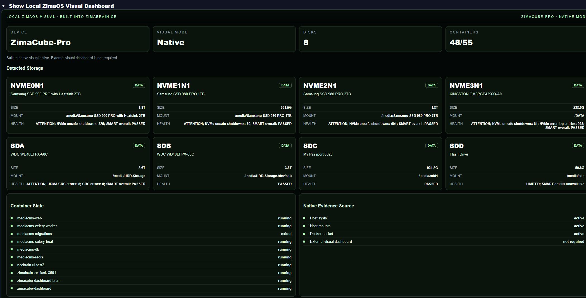 |

---

> ℹ️ **Postfix relay** — an internal SMTP relay used by the stack, not published on any host port.

---

## Support

Found a bug or want to request an app? Open an issue on the [Zima OS GitHub repository](https://github.com/HSinghHira/ZimaAppStore/issues).